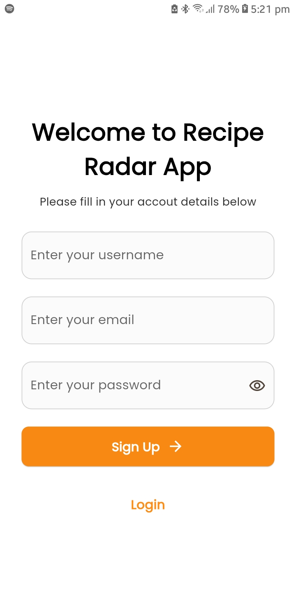
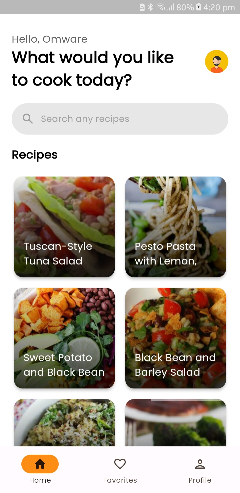
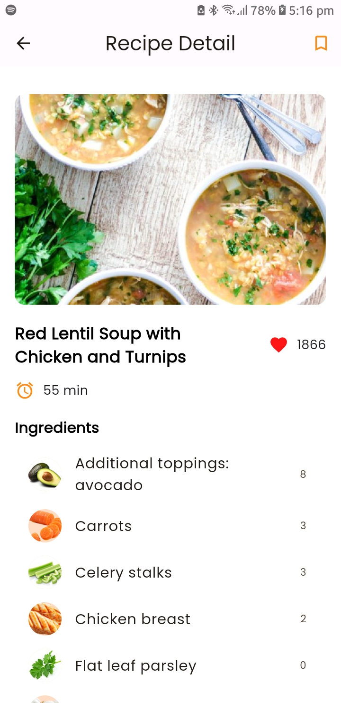
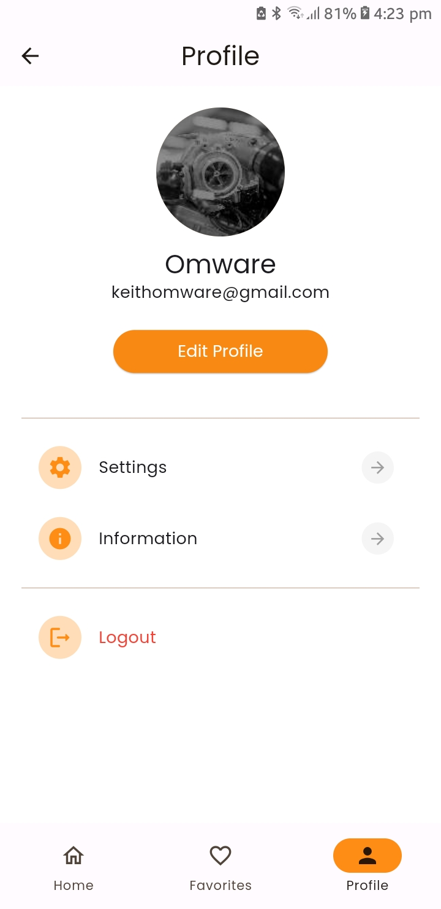

# Recipe Radar

Recipe Radar is a Flutter application that allows users to discover, save, and organize their favorite recipes. Users can browse recipes by type, view detailed information for each recipe, and save recipes to their favorites for easy access.

| Welcome Screen                             | SignIn/LoginIn Screen                     | Home Screen                             |
| ------------------------------------------ | ----------------------------------------- | --------------------------------------- |
|  |  |  |

| Recipe Detail Screen                             | Favorites Screen                             | Profile Screen                             |
| ------------------------------------------------ | -------------------------------------------- | ------------------------------------------ |
|  |  |  |  |

## Built With 🛠
- **Flutter** - Frontend development framework.
- **Dart** - Programming language for Flutter.
- **Spoonacular API** - Used for fetching recipe data.
- **Firebase SDK** - Used for authentication and storing favorite recipes and user data.
- **Riverpod** - A reactive caching and data-binding framework.
- **HTTP** - Dart package for making HTTP requests.
- **Connectivity** - Dart package for checking internet connectivity.


## Configuration and API Keys

### Handling Sensitive Information
This project uses a `config.dart` file to manage sensitive information like API keys. To ensure security and prevent accidental exposure of sensitive data:

1. **Add `config.dart` to `.gitignore`:** 
   Ensure that `config.dart` is included in the `.gitignore` file. This prevents Git from tracking changes to this file and avoids committing sensitive information to the repository.

    ```
    # .gitignore

    # Exclude config.dart to prevent it from being tracked
    /utils/config.dart
    ```

2. **Create `config_sample.dart`:**
   Provide a `config_sample.dart` file (or similarly named) that contains placeholders or instructions for setting up the necessary configurations. This file should be committed to the repository and serves as a template for developers to create their own `config.dart` file.

   ```dart
   /* config_sample.dart */

   class Config {
     static const String apiKey = 'YOUR_API_KEY_HERE';
   }

## Contact
Email - keithomware@gmail.com

## License
```
MIT License

Copyright (c) 2024 Keith Omware

Permission is hereby granted, free of charge, to any person obtaining a copy
of this software and associated documentation files (the "Software"), to deal
in the Software without restriction, including without limitation the rights
to use, copy, modify, merge, publish, distribute, sublicense, and/or sell
copies of the Software, and to permit persons to whom the Software is
furnished to do so, subject to the following conditions:

The above copyright notice and this permission notice shall be included in all
copies or substantial portions of the Software.

THE SOFTWARE IS PROVIDED "AS IS", WITHOUT WARRANTY OF ANY KIND, EXPRESS OR
IMPLIED, INCLUDING BUT NOT LIMITED TO THE WARRANTIES OF MERCHANTABILITY,
FITNESS FOR A PARTICULAR PURPOSE AND NONINFRINGEMENT. IN NO EVENT SHALL THE
AUTHORS OR COPYRIGHT HOLDERS BE LIABLE FOR ANY CLAIM, DAMAGES OR OTHER
LIABILITY, WHETHER IN AN ACTION OF CONTRACT, TORT OR OTHERWISE, ARISING FROM,
OUT OF OR IN CONNECTION WITH THE SOFTWARE OR THE USE OR OTHER DEALINGS IN THE
SOFTWARE.
```